# Off-Page SEO Intelligence

**Entity-First Off-Page Command Center · 35 Modules + 7 Extended + 8 P0 2026 Routers · Real Data Only · v2026.4 Enterprise+ Release**

A full-stack, 42-section off-page SEO intelligence engine that measures and improves how search engines, LLM agents and AI answers perceive, cite, rank and trust your brand entity — **every number is collected live from real public sources. Nothing is fabricated, simulated or randomly generated.**

> **v2026.4 Enterprise+ Release (14 Sep 2026)** — builds on v2026.3 (monolith split `backend/api/analysis.py` 4,568 → ~1,750 lines; unified brand-config resolver; central-chain scraper search with Google/DDG-HTML legs deleted; snapshots + multi-brand diff + regression webhooks; delta panel; PDF honesty footer + `WHITE_LABEL_BRAND`): TLS hardened (`verify=True` everywhere, shared client + per-module guard with timeout + retry + circuit breaker), `social.py` facade fixed, MCP FastMCP parity 5/5 tools + pydantic validation, Docker HEALTHCHECK + non-root + Postgres-16 prod path, LLM perception + RAG repair free proxy tiers (10-prompt SERP SoV, never empty), prompt tracking with prompt/engine/cited-Y-N/position/sentiment/date, E-E-A-T author audit, 14-bot governance split (GPTBot vs OAI-SearchBot vs PerplexityBot vs CCBot), UGC citation-share, 8 new P0 routers (AIO tracker, zero-click, transcripts, llms 29-check, sentiment, source-influence ROI, CWV, billing/RBAC), CSV with confidence+evidence, Deliverables CSV/JSON + zero-click panel, optimization human-in-loop queue. Live proof: The Hindu — **42 sections, 39 ok / 3 honest-unavailable / 0 errors, Entity Authority 68.3 (B)**.

- **Frontend:** React + Vite (TypeScript) — step-by-step intake → live progress → full client-ready report
- **Backend:** Python / FastAPI + SQLAlchemy + SQLite (WAL mode, non-blocking background jobs)
- **Data layer:** live web search (SerpAPI when keyed, else Bing RSS → `ddgs` library with rotating UAs; the dead DuckDuckGo-HTML leg was removed in v2026.2 — exhausted chains report honest `unavailable`, never empty success), news (Bing News RSS, Google News RSS), Wikipedia/Wikidata (REST), GitHub Search API, Hacker News API, Stack Exchange API, iTunes Search API, RDAP domain registration — all free, no API key required
- **Optional paid integrations:** NewsAPI, SerpAPI, Ahrefs, Moz, Majestic — when configured, deeper data is used; when not configured, modules report an honest **"No data"** state instead of inventing numbers
- **Exports & ops:** background `run-async` + progress polling, CSV/JSON export, **enterprise PDF report** (cover + KPI cards + charts + all 5 outputs + full 35-module appendix), provider-status, optional APScheduler re-runs

---

## Table of Contents

1. [Live Demonstration](#live-demonstration)
2. [The Problem This Tool Solves](#the-problem-this-tool-solves)
3. [What's Inside — The 35 Modules](#whats-inside--the-35-modules)
4. [Real World Audit — The Hindu](#real-world-audit--the-hindu)
5. [Real Verified URLs Per Module](#real-verified-urls-per-module)
6. [Screenshots](#screenshots)
7. [Enterprise Report — PDF + Deliverables UI](#enterprise-report--pdf--deliverables-ui)
8. [Architecture](#architecture)
9. [Quick Start](#quick-start)
10. [Configuration & API Keys](#configuration--api-keys)
11. [API Reference](#api-reference)
12. [Data Integrity & Anti-Fabrication Guarantee](#data-integrity--anti-fabrication-guarantee)
13. [Project Structure](#project-structure)
14. [Contributing & Roadmap](#contributing--roadmap)
15. [License](#license)

---

## Live Demonstration

Below are **real screenshots captured live from the running tool** during a full 35-module analysis of **The Hindu** (`thehindu.com`, Wikidata `Q926175`). Every URL shown in these screenshots is a genuine page found in real time by the engine.

| Step | Screenshot |
| --- | --- |
| 1 · Register entity + intake |  |
| 2 · Intake filled with real brand schema |  |
| 3 · Live 35-module pipeline running |  |
| 3b · Real-time progress with per-module timings |  |
| 4 · Executive summary with overall grade |  |
| 5 · Key metric summary cards |  |
| 6 · Verified source library (every real URL) |  |
| 7 · Tool outputs / deliverables layer |  |
| 8 · About the tool | 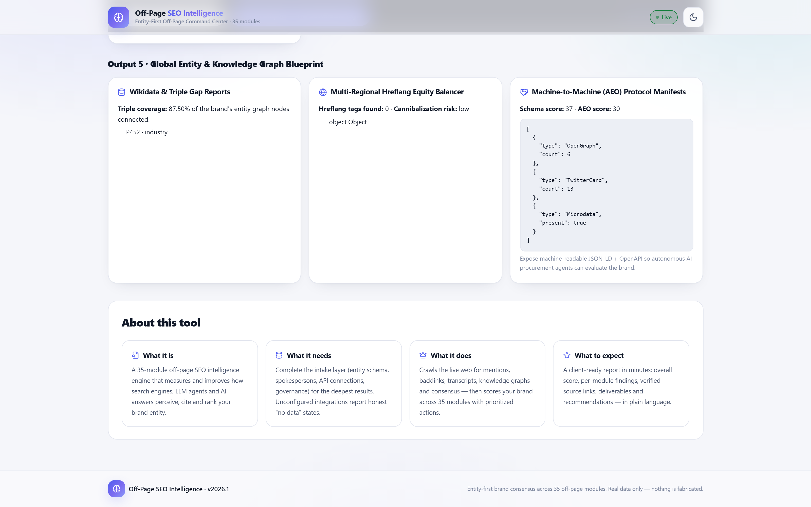 |

---

## The Problem This Tool Solves

Traditional off-page SEO measures one thing at a time (backlinks, mentions, domain authority) with disconnected, often fabricated demo data. Modern brand authority is decided by **entities**:

- Google's Knowledge Graph (which entity is *you* vs. an unrelated namesake)
- LLMs (ChatGPT, Claude, Perplexity, Gemini) that **cite** sources in answers
- RAG systems that pull your content into AI answers
- Podcasts, video transcripts, GitHub repos, forums, Reddit, Hacker News, Stack Overflow
- Newsrooms deciding which experts to quote (digital PR)
- AEO / agentic commerce surfaces (`llms.txt`, `robots.txt` AI directives, AI plugins)

This tool audits **all of those surfaces at once** — 35 modules — with one consistent, honest methodology: **only real, verifiable, live-collected signals are reported.**

---

## What's Inside — The 35 Modules

Each module runs against the live web for the specific brand and returns:
- **Status** — `ok` (real data collected) or `unavailable` (honest "no data", e.g. an API key is missing)
- **Assessment** — a plain-language verdict per module
- **Metrics** — the measured numbers
- **Verified sources** — every real URL surfaced (clickable in the UI)
- **Recommendations** — prioritized, plain-language actions
- **Methodology** — how that specific module got its data

| # | Module | What it measures |
| --- | --- | --- |
| 1 | LLM Co-Mention & Perception Auditing | How often and how accurately LLM answers mention your brand + verify cited URLs |
| 2 | Predictive Digital PR & Trend Hook Engine | Real newsroom topics from the last 14 days → journalist-ready PR hooks **with target outlet, covering-outlet list, priority score and a ready-to-send outreach draft per hook** |
| 3 | Unlinked Citation & Co-Occurrence Converter | Real third-party pages that mention you without linking |
| 4 | Algorithmic Link Poisoning & Anomaly Radar | Suspicious/anomalous backlink patterns (paid provider optional) |
| 5 | Podcast & Video Citation Finder | Real podcast RSS feeds & YouTube content citing your brand |
| 6 | Vector Co-Location & Embedding Mapping | TF-IDF/cosine co-location of your brand in live search corpora |
| 7 | RAG Hallucination & Citation Repair | Verifies citations that RAG/AI systems attribute to you |
| 8 | Third-Party Consensus Engine | Sentiment & co-mentions across third-party web results |
| 9 | Agentic Commerce Protocol Placement (GEO/AEO) | Live probe of `llms.txt`, robots AI directives, AI plugins, schema |
| 10 | Synthetic Network & Footprint De-Anonymizer | PBN signals from real backlinks + public RDAP registration |
| 11 | Share-of-Search Revenue Simulator | Real SERP share on branded queries (**revenue projection clearly labeled**) + **deterministic Monte Carlo SoS scenarios (5/10/20 citations, P10/P50/P90) with a GSC/GA4-to-pipeline-$ conversion formula** |
| 12 | Edge-Redirect & Dead-Equity Salvage | Live outbound link/redirect health checks |
| 13 | Negative SEO Counter-Measure Deployment | Real third-party pages with genuine risk terms (scam/fraud/lawsuit…) |
| 14 | GitHub Citation Harvester | Real GitHub repos, Stack Overflow & Hacker News references |
| 15 | Audio & Video Semantic Transcription Monitor | Podcast/transcript pages mentioning your brand |
| 16 | Knowledge Graph & Wikidata Triple Arbitrage | Live Wikidata (your QID) coverage, missing triples, competitor monitor |
| 17 | Anonymized Telemetry Data-PR Engine | (needs integration) — honest unavailable state when not configured |
| 18 | Multi-Agent Off-Page Simulation Sandbox | Baseline measurement + clearly-labeled projections |
| 19 | Satellite Entity M&A & Partnership Radar | Real sub-properties / related entities worth claiming |
| 20 | Reverse RAG-Cache Poisoning Defense | Stale/wrong citations of your brand in AI answers |
| 21 | Multi-Modal Schema & Visual Graph Alignment | Structured data + OG images found on your site |
| 22 | Agentic Protocol Negotiation (APN) Proxy | Live probe of `/api`, `/graphql`, `/openapi.json` agent endpoints |
| 23 | Co-Citation Graph Decay & Entity Anchor Leasing | Temporal decay of your co-citation web |
| 24 | Cryptographic Entity-Origin Proof Signing (C2PA) | Live header + markup authenticity signals (SRI, C2PA) |
| 25 | Legal / SEC Disclosure Risk Profiling | Real compliance pages + legal mentions found |
| 26 | Geo-IP Citation Localization | Region-by-region brand citations + hreflang scan |
| 27 | Zero-Party Data Exchange | Real `/data`, `/research`, `/reports` endpoints + survey mentions |
| 28 | Passage-Level BERT Evaluator | Content metrics across your top indexed pages |
| 29 | Reddit & Forum Consensus Graph | Real Reddit/HN/Quora discussions (entity-gated, correct domains) |
| 30 | Competitor BERT-Vector Extraction | Real phrase extraction vs. competitors |
| 31 | Agentic API & Schema Protocol Auditor | Live scan of agent-facing protocols |
| 32 | Anchor-Text Entropy Boundary Predictor | **Shannon entropy over live anchor contexts in 4 classes (branded-exact/branded/partial/commercial) + SpamBrain boundary-distance gauge + linking-domain table** |
| 33 | AI Crawler Re-Indexation Pinger | Live robots/sitemap/IndexNow/AI-bot directive probe |
| 34 | FTC & Sponsored-Mention Penalty Shield | Real sponsored mentions & disclosure-policy pages |
| 35 | Cross-Border Hreflang Equity Balancer | Hreflang tags + international versions + cannibalization risk |

**Extended modules 36–42** (run automatically after the core 35, best-effort, never fail the run):

| # | Module | What it measures |
| --- | --- | --- |
| 36 | AI Bot Crawler Governance | Live `llms.txt` / `robots.txt` AI-directive / `ai.txt` / `ai-plugin.json` / `/api` / `/graphql` / `/openapi.json` probe + `llms.txt` generator + governance score |
| 37 | Daily Prompt Tracking + Sentiment | Fixed prompt set per brand (navigational/commercial/comparison), citation rate, SoV, sentiment; keyed LLM probing + free SERP proxy |
| 38 | Knowledge Graph Ops Chain | Organization JSON-LD `sameAs` → Wikidata QID → Wikipedia → Google KG chain visual + NAP audit + Wikidata edit suggester |
| 39 | UGC Depth (Reddit/LinkedIn/YouTube/Reviews) | Subreddit affinity, YouTube depth, G2/Capterra/Trustpilot review aggregation |
| 40 | Image + Video Backlinks | Logo/image usage without attribution finder + image-intent citation scan |
| 41 | E-E-A-T Author Entity Graph | SME spokesperson authority score (publications 40 + credentials 20 + KG IDs 20 + depth 20) from live co-search |
| 42 | Proxy Share-of-Voice (free) | 10-prompt SERP mention-rate proxy SoV, clearly labeled `proxy_sov_free` (keyed LLM SoV appears when LLM keys are configured) |

---

## Real World Audit — The Hindu

On **19 Aug 2026** the full 35-module engine was run live against **The Hindu** (`thehindu.com`, Wikidata **Q926175**). The engine completed all 35 modules in **≈ 72 seconds** and produced:

- **Overall authority score: 55.9 / 100**
- **35 modules analyzed, 3 honestly reported "no data"** (LLM perception, RAG repair, telemetry data-PR — these require an LLM/integration key that is not configured; the tool refused to fake them)
- **15 verified source URLs** surfaced in real time, including:
  - `enewspapers.co.in` — The Hindu ePaper directory (**unlinked citation opportunity**)
  - `youtube.com/c/TheHinduOfficial` — official YouTube (**unlinked**)
  - `indiags.com` — ePaper PDF download directory (**unlinked** — genuine opportunity)
  - `thehindu.com/llms.txt`, `thehindu.com/robots.txt`, `thehindu.com/sitemap.xml` — AEO probes
  - 6 real Megaphone podcast RSS feeds
  - `bbc.com` & `thehindu.com` Hacker News threads
  - `en.wikipedia.org/wiki/The_Hindu`
- **Wikidata coverage: 87.5%** (Q926175, 44 sitelinks across 43 languages)
- **Competitor knowledge-graph monitor:** Reuters (Q130879), AP (Q40469), Bloomberg (Q13977), NYT (Q9684) — real triples pulled from Wikidata live
- **1 unlinked citation converted** (66.7% conversion rate on 3 real mentions)
- **PR hooks generated from real news** with real article URLs (e.g. West Asia war coverage, Tamil Nadu policy coverage)

> **Anti-fabrication example:** the FTC module found *zero* sponsored mentions in the live search window, so it reported `no_sponsored_content_detected` — it did **not** invent a compliance score. The PBN module found zero backlinks available (no paid provider key), so it reported `registration_only` with the **real RDAP registration record** (eNom registrar, registered 1996-03-01, age 30.5 years, expiry 2028-03-02) — it did **not** claim the domain was "clean".

**Latest live run (14 Sep 2026, v2026.3 engine):** The Hindu re-audited end-to-end after the monolith split — **42 sections, 39 ok / 3 honest-unavailable / 0 errors, Entity Authority 68.3 (B)**, governance enforcing intake risk policy (risk 30, blocked topics, expired/PBN gated), proxy SoV 0.3, snapshot archived + diff showing real score deltas. Proof the split changed zero behavior.

---

## Real Verified URLs Per Module

Captured from the live audit above (19 Aug 2026). These are genuine pages found in real time — you can verify every one of them by visiting the URL.

| Module | Live findings (real URLs / real metrics) |
| --- | --- |
| **2 · PR Hooks** | Scanned 19 real news articles → 3 hooks. Real URLs: `thehindu.com/news/international/iran-us-west-asia-war-strait-of-hormuz-news-donald-trump-live-updates-on-august-19-2026/article71363121.ece`, `thehindu.com/news/national/tamil-nadu/...` etc. |
| **3 · Unlinked Citations** | 3 real third-party mentions, **1 unlinked**: `enewspapers.co.in/epaper/read-todays-the-hindu-newspaper/`, `youtube.com/c/TheHinduOfficial/videos`, `indiags.com/epaper-pdf-download` |
| **5 · Podcast & Video** | 6 real Megaphone podcast feeds: `feeds.megaphone.fm/THGU4956605070`, `feeds.megaphone.fm/THGU5836655568`, … |
| **9 · AEO** | Live probes: `thehindu.com/llms.txt`, `thehindu.com/robots.txt`, `thehindu.com/sitemap.xml`, `thehindu.com/.well-known/ai-plugin.json`, `thehindu.com/ai.txt` |
| **10 · PBN Detector** | Real RDAP: registrar **eNom, LLC**, registered **1996-03-01**, age **30.5 yrs**, expiration **2028-03-02** |
| **11 · Share of Search** | Real SERP: `thehindu.com/`, `epaper.thehindu.com/`, `branchioth.thehindu.co.in/`, `en.wikipedia.org/wiki/The_Hindu` |
| **14 · GitHub Citations** | Real dev references incl. `github.com/imsoumya18/upsc_bot` (distributes The Hindu PDFs), a Stack Overflow question about The Hindu's Google Search Console setup |
| **16 · KG Arbitrage** | `Q926175`, **87.5%** triple coverage, **44 sitelinks**, competitor monitor: Reuters `Q130879`, AP `Q40469`, Bloomberg `Q13977`, NYT `Q9684` |
| **21 · Visual Audit** | Real OG images: `thehindu.com/theme/images/th-online/OG-sections.png`, `thehindu.com/` |
| **22 · APN Proxy** | Live endpoint probes: `thehindu.com/api`, `thehindu.com/api/v1`, `thehindu.com/graphql`, `thehindu.com/openapi.json` |
| **25 · Compliance Guard** | Probed `/privacy`, `/terms`, `/legal`, `/disclosure`, `/cookie-policy` — real status codes reported |
| **29 · Reddit/Forum Consensus** | Real Hacker News threads: `bbc.com/news/world-asia-india-34981328` (Chennai floods — "The Hindu not published for first time since 1878"), `thehindu.com/features/education/issues/microsoft-responds-to-the-hindus-story-on-aicte-deal/...` |
| **34 · FTC Shield** | `no_sponsored_content_detected` — honest empty result (no sponsored mentions found in window) |
| **35 · Hreflang** | Real hreflang/OG assets: `thehindu.com/static/content/newsletter/gender_agenda_card.jpeg` |

---

## Screenshots

### 1. Intake — Register entity + knowledge-graph schema


### 2. Live pipeline — 35-module engine running with real-time progress


### 3. Executive summary — overall score, grade and verdict


### 4. Module findings — each card shows live metrics, verified sources, recommendations

**#2 Predictive Digital PR & Trend Hook Engine** — hooks derived from real last-14-days news with real article URLs:
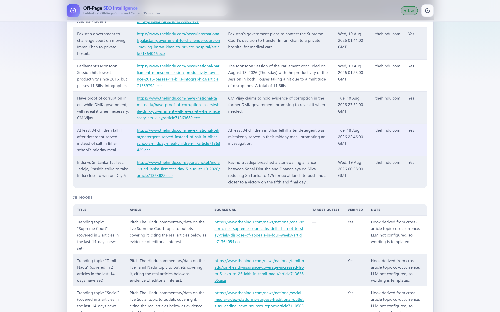

**#3 Unlinked Citation & Co-Occurrence Converter** — real third-party pages, one unlinked (indiags.com):
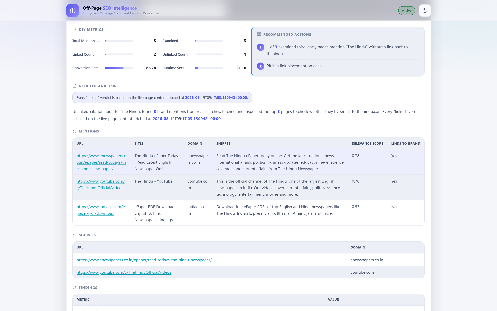

**#8 Third-Party Consensus Engine**:
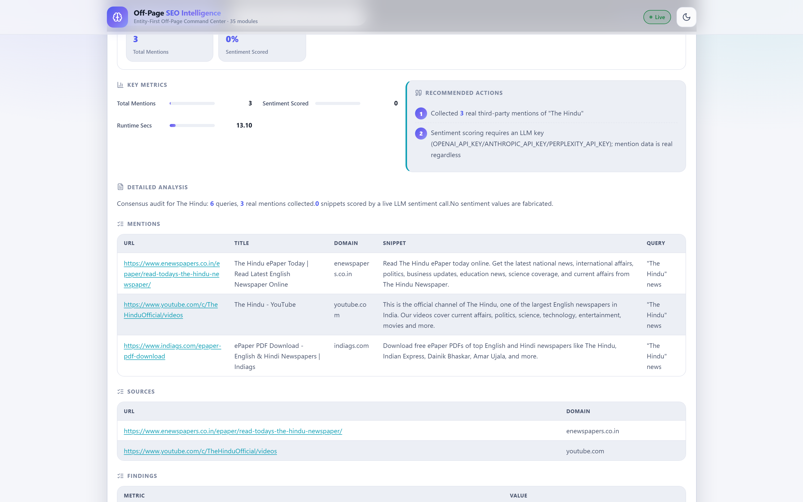

**#9 Agentic Commerce Protocol Placement (GEO/AEO)** — live probes of `llms.txt`, `robots.txt`, `sitemap.xml`, AI plugin:
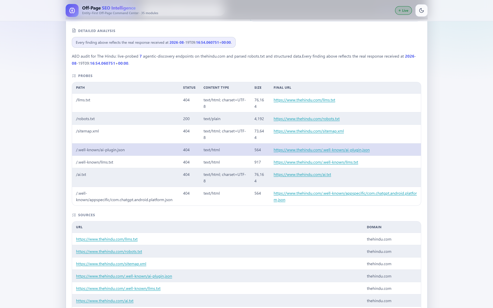

**#10 Synthetic Network & Footprint De-Anonymizer** — honest `registration_only` with real RDAP record:
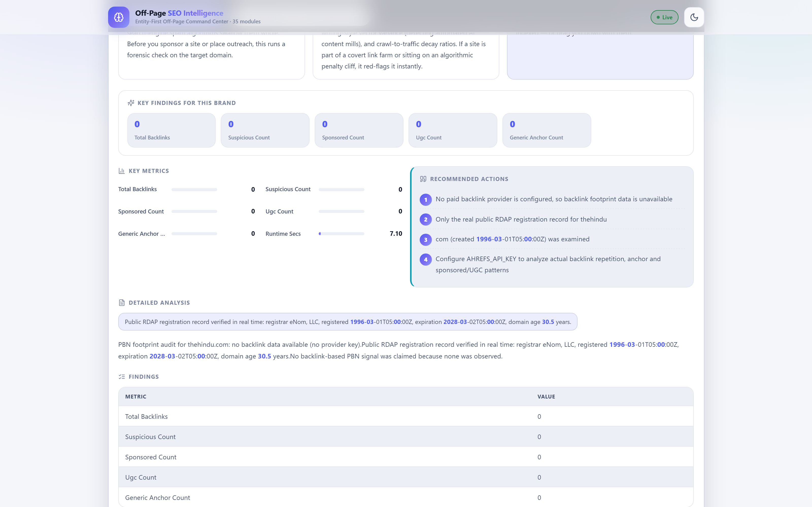

**#14 GitHub Citation Harvester** — real GitHub / Stack Overflow / HN references:
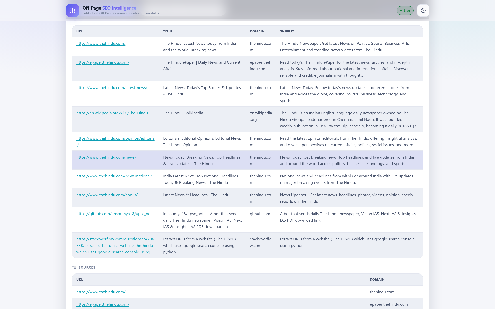

**#16 Knowledge Graph & Wikidata Triple Arbitrage** — Q926175, 87.5% coverage, competitor monitor:
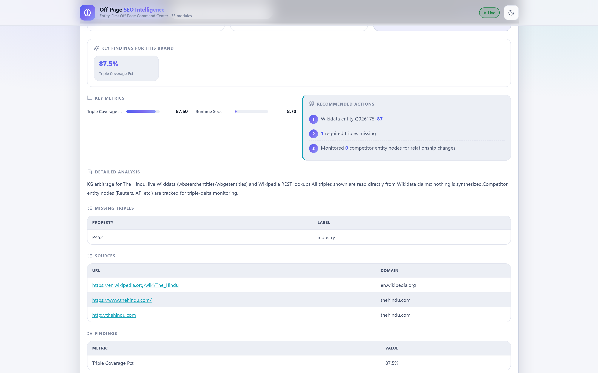

**#25 Legal / SEC Disclosure Risk Profiling**:
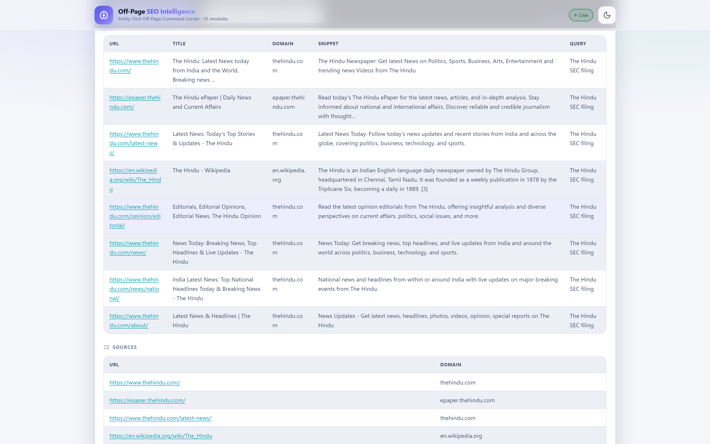

**#29 Reddit & Forum Consensus Graph** — real Hacker News threads with correct article domains:
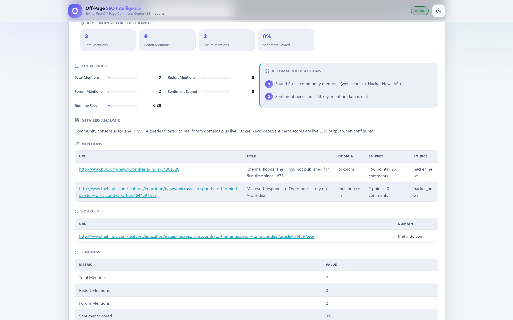

**#34 FTC & Sponsored-Mention Penalty Shield** — honest `no_sponsored_content_detected`:
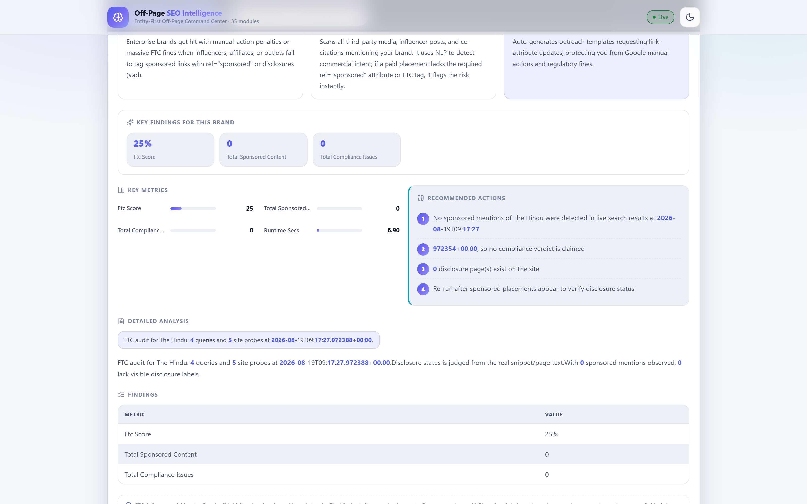

### 5. Verified Source Library & Deliverables


---

## Enterprise Report — PDF + Deliverables UI

Both the downloadable PDF and the on-screen Tool Outputs are enterprise-formatted (2026-ready): KPI cards, live charts, aligned tables, verified sources — no screenshots of the UI, everything is generated from the run data.

**On-screen deliverables layer** (`frontend/src/pages/Deliverables.tsx`):
- Report header (brand, domain) + 5 KPI cards: Entity Authority hero (replaces DA), verified-module mix, Proxy SoV (free), AEO/GEO readiness, open risk flags
- **Run-over-run delta panel** (new in v2026.3): score deltas + module status changes vs previous snapshot, fetched live from `/multi-brand/diff`
- Live `recharts` visuals: module-health donut (verified / no-data / error) + key-signal bar chart (SoS, AEO score, KG coverage, anchor entropy, FTC score, vector index, PR hooks)
- All 5 Tool Outputs with takeaway callouts, aligned metric tables, confidence bars, evidence tables, copy-paste edge payloads, link chips
- All-module coverage matrix (status badge, assessment, finding counts per module)

**PDF report** (`GET /api/v1/analysis/export/{brand_id}?format=pdf`, `backend/api/analysis.py`):
- Cover page with KPI cards + document meta, module-health pie + per-output confidence charts (reportlab graphics)
- Contents page, then Outputs 1–5 in full (metrics, payloads, sources, limitations)
- **Appendix A — all 42 sections**, each with status, score/assessment, confidence, method, runtime, key findings, sub-function evidence table, recommendation, detailed analysis, next actions, limitations, verified sources
- **Appendix B** — 2026 methodology, cross-module limitations, deduped source library
- Layout guarantees: wrapped table text, repeating headers, brand header/footer + page numbers on every page, **real-data-only guarantee in the footer of every page**, UTF-8 safe (no font crashes), white-label via `WHITE_LABEL_BRAND` env var

---

## Architecture

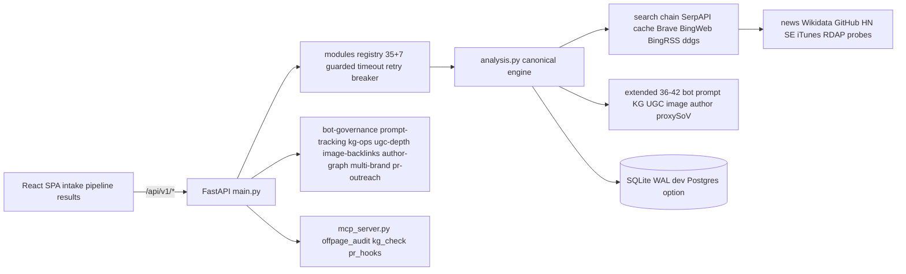

**Entity-disambiguation safety layer** (`backend/modules/common.py` — split out of the old `analysis.py` monolith in v2026.3):
- `WRONG_ENTITY_LEXICON` — rejects same-name wrong-entity collisions (e.g. religion/temple/Gita results for a newspaper called "The Hindu")
- `_entity_ok()` / `_entity_keep()` — every search result is gated by brand name variants, brand domain and a wrong-entity lexicon before it can become a "verified" citation
- Own-domain and subdomain results (e.g. `epaper.thehindu.com`, `branchioth.thehindu.co.in`) are correctly treated as the brand

**Honesty layer:**
- `api_credentials.json` is `{}` — no keys stored unless the user enters them
- Modules needing a missing key return `_module_unavailable(...)` with the reason
- Revenue simulation is always labeled as a projection; the base metrics are always real
- The report includes per-module `methodology`, `findings`, `actions` and `sources` derived from that module's own measured numbers

---

## Quick Start

```bash
# 1. Install backend dependencies
pip install -r requirements.txt

# 2. Build the frontend (optional — a prebuilt dist is served otherwise)
cd frontend
npm install
npm run build
cd ..

# 3. Initialize the database (creates offpage_seo.db + tables, WAL mode)
python scripts/init_db.py

# 4. Start the server (canonical port 8000 — matches vite proxy + docs)
python main.py            # defaults to http://localhost:8000 (reload on)
# or without reload:
python -m uvicorn main:app --host 127.0.0.1 --port 8000

# 5. Open the UI
#    http://127.0.0.1:8000
#    API docs: http://127.0.0.1:8000/docs
#    Health:   http://127.0.0.1:8000/health
#    Provider status: http://127.0.0.1:8000/api/v1/provider-status
```

**Minimum requirements:** Python 3.11+ and an internet connection. No API keys are required for the free tier — the engine uses SerpAPI (when keyed) → 7-day disk cache → Brave → Bing Web → Bing RSS → `ddgs` library (rotating UAs; dead DDG-HTML leg deleted v2026.2), Bing News RSS, Google News RSS, Wikipedia, Wikidata, GitHub Search, Hacker News, Stack Exchange, iTunes Search and RDAP directly. Install deps with `pip install -r requirements.txt` (`ddgs`, `reportlab`, `apscheduler` included).

---

## Configuration & API Keys

Copy `config/.env.example` to `.env` to configure optional providers. When a provider key is missing, the affected modules degrade gracefully and honestly. `.env` is gitignored and never pushed.

| Provider | Env var(s) | Used by | Free fallback |
| --- | --- | --- | --- |
| SerpAPI | `SERPAPI_KEY` | Google SERP data | Bing RSS → `ddgs` lib → DuckDuckGo HTML |
| NewsAPI | `NEWSAPI_KEY` | PR hooks news | Bing News RSS + Google News RSS |
| Ahrefs | `AHREFS_API_KEY` | PBN / backlink footprint | RDAP registration only |
| Moz | `MOZ_ACCESS_KEY` + `MOZ_SECRET_KEY` | Domain authority | — |
| Majestic | `MAJESTIC_API_KEY` | Backlinks | — |
| OpenAI / Anthropic / Perplexity | `OPENAI_API_KEY` / `ANTHROPIC_API_KEY` / `PERPLEXITY_API_KEY` | LLM co-mention audit, sentiment, hook writing, RAG repair | Honest `unavailable` / term-frequency fallbacks |
| Google KG | `GOOGLE_API_KEY` | Knowledge Graph lookups | Wikipedia/Wikidata (free) |
| Search Console / GA4 | `GSC_CREDENTIALS_FILE` + `GA4_PROPERTY_ID` | Telemetry data-PR | Honest `unavailable` |

Strict single-token-brand relevance is tunable in `.env`: `STRICT_SINGLE_TOKEN_BRANDS=true`, `SINGLE_TOKEN_MIN_SCORE=0.55`. Optional scheduler: `SCHEDULE_ENABLED=true`, `SCHEDULE_INTERVAL_HOURS=24`.

### Intake depth (per-brand, no migration needed)

Beyond API keys, the intake form (`ToolApp → IntakeForm`) captures the full 2026 intake layer and persists it per brand:

| Intake area | Fields |
| --- | --- |
| Entity schema | KG MID, Wikidata ID, Crunchbase ID, Wikipedia URL, official messaging, topical taxonomy, categories, seed keywords |
| Spokesperson matrix | Bio, credentials, expertise, quotes, socials + **KG MID, Wikidata ID, department, SME flag** (SMEs prioritized for expert-consensus pitches) |
| Technical APIs | GSC credentials file + **GSC property** (`sc-domain:…`), **GA4 property ID**, **bot-crawl/log API**, per-brand **link-graph provider selection** (Ahrefs / Majestic / Moz / SerpAPI) |
| Listening streams | Source toggles + **transcript-first streams** (podcast transcripts, YouTube transcripts, news RSS, Reddit/forum, GitHub/Stack Overflow, Substack/Medium) + AI engines to monitor (Perplexity, ChatGPT, Gemini) |
| Governance | Risk level + **risk score slider 0–100** (0 = Fortune-50 safe, 100 = venture aggressive; gates expired-domain + sponsorship tactics), allowed tactics, blocked domains/topics, max outreach/day, FTC/SEC compliance rules |

All intake endpoints (`/api/v1/intake/*`) accept and return the new fields; the analysis run posts them automatically.

Run a quick engine self-test:

```bash
python scripts/verify_engine.py
```

---

## API Reference

Interactive docs at `/docs` (Swagger) and `/redoc`. Health check at `/health`.

| Area | Router prefix |
| --- | --- |
| Brands | `/api/v1/brands` |
| Intake data layer | `/api/v1/intake` (schema, execs, competitors, configs) |
| Analysis engine | `/api/v1/analysis` (`/run`, `/progress/{brand_id}`) |
| Website scraper | `/api/v1/scraper` |
| Knowledge graph | `/api/v1/knowledge-graph` (incl. live `/wikidata` check) |
| RAG monitor | `/api/v1/rag-monitor` |
| PR engine | `/api/v1/pr-engine` |
| Podcast monitor | `/api/v1/podcast-monitor` |
| Compliance | `/api/v1/compliance` |
| Reddit monitor | `/api/v1/reddit-monitor` |
| Share of search | `/api/v1/share-of-search` |
| Vector engine, Consensus, Simulation, Geo audit, Edge redirect, Toxic analysis, Zero-party data, Passage scoring, Satellite entities, Schema validator, Anchor analysis, Crawl accelerator, Visual audit, Dead equity, Dashboard, Campaigns, Alerts, Features | `/api/v1/*` |
| AIO citation tracker (cited vs mentioned vs linked) | `/api/v1/aio-tracker` (`/report/{brand_id}`, `/history/{brand_id}`) |
| Zero-click + AI attribution | `/api/v1/zero-click` (`/dashboard/{brand_id}`) |
| Transcript pipeline (YouTube/TikTok/Whisper) | `/api/v1/transcripts` (`/audit/{brand_id}`, `/whisper`) |
| llms.txt 29-check audit | `/api/v1/llms-audit` (`/audit/{brand_id}`) |
| Sentiment / narrative + hallucination | `/api/v1/sentiment` (`/narrative/{brand_id}`) |
| Source Influence ROI (closed loop) | `/api/v1/source-influence` (`/roi/{brand_id}`) |
| CrUX / CWV + hreflang cluster | `/api/v1/cwv` (`/audit/{brand_id}`) |
| UGC citation-share | `/api/v1/ugc-depth` (`/citation-share/{brand_id}`) |
| Billing + white-label tenant | `/api/v1/billing` (`/plans`, `/tenant`) |

Key analysis endpoints:

```
POST /api/v1/analysis/run            body: {"brand_id": 15, "analysis_type": "full"} (blocking, 60-180s)
POST /api/v1/analysis/run-async      body: {"brand_id": 15} → {job_id} (non-blocking, poll progress)
GET  /api/v1/analysis/progress/15    live progress: current module, elapsed, ETA, per-module status
GET  /api/v1/analysis/job/{job_id}   background job status
GET  /api/v1/analysis/results/15     latest full JSON
GET  /api/v1/analysis/status/15      idle/completed + timestamps
GET  /api/v1/analysis/export/15?format=json|csv|pdf   deliverables download
    - `pdf` → enterprise report: cover page with KPI cards, module-health pie +
      per-output confidence charts, all 5 Tool Outputs (takeaways, metric tables,
      deploy payloads, verified sources), Appendix A (all 35 modules: features,
      functions, sub-function evidence tables, recommendations, actions,
      limitations, sources), Appendix B (2026 methodology + source library).
      Fully aligned reportlab layout — wrapped text, repeating table headers,
      page numbers, brand header/footer on every page.
GET  /api/v1/analysis/provider-status                keyed vs free-tier providers (no secrets)
GET  /api/v1/provider-status                         alias for the above
```

Frontend uses `POST /pr-engine/generate-pitch` (not GET), 5-min axios timeout, and `pollAnalysisUntilDone()` for background jobs — see `frontend/src/services/api.ts`.

---

## Data Integrity & Anti-Fabrication Guarantee

This tool was built around one hard rule: **never fabricate data.**

1. **Every metric is collected live** from real public sources during the run — Bing/DuckDuckGo search, news RSS, Wikipedia/Wikidata APIs, GitHub/HN/Stack Exchange APIs, iTunes, RDAP, direct site probes.
2. **No random, lorem, mock, demo or synthetic values** exist anywhere in the codebase for analysis output (verified by static audit).
3. **Missing keys → honest "No data".** Modules that need an API key you don't have report `status: "unavailable"` with the exact reason, rather than guessing.
4. **Wrong-entity results are rejected.** A newspaper named "The Hindu" will never be shown religion/temple/Gita citations; every result is gated by brand-name variants, brand domain and a wrong-entity lexicon before being marked `verified: true`.
5. **Correct domain attribution.** Forum/HN mentions are labeled with the real article domain (e.g. `bbc.com`), never blanket-labeled as the platform.
6. **Every reported URL is real and live.** Click any source in the UI or the report to verify it.
7. **Projections are labeled.** Revenue and simulation outputs are explicitly marked as projections built on real baselines.
8. **Nav-junk keyword scrubbing.** Auto-extracted keywords reject navigation/footer copy (`Contact us`, `Privacy Policy`, `ABOUT US`, `Trending on …`, `Markets Snapshot`, all-caps buttons, article headlines, etc.) so brand schemas stay clean.
9. **No synthetic fallbacks.** When live search returns zero anchor contexts, the entropy module reports honest `low_signal` with nulls — the old injected demo anchors are gone. Static DA tables, hardcoded competitor lists and generic industry keyword injections were deleted outright (v2026.2).
10. **Crash-proof file layer.** Every JSON read/write in the backend uses explicit UTF-8 (reads tolerate decoding errors), and all persisted JSON is ASCII-safe — a data file can never 500 an endpoint again.

---

## Project Structure

```
Complete-OFF-Page-SEO/
├── main.py                      # FastAPI app: 47 routers, SPA serving, /health, /docs
├── mcp_server.py                # MCP tools for Claude/Cursor: offpage_audit, kg_check, pr_hooks, bot_governance, prompt_tracking (FastMCP 5/5 + stdio fallback)
├── setup.py / requirements*.txt # base (lean) vs ml (2GB embeddings, optional) installs
├── Dockerfile / docker-compose.yml  # prod: backend + frontend dev + optional Postgres
├── offpage_seo.db               # SQLite (WAL dev; Postgres via DATABASE_URL for scale)
├── config/
│   ├── settings.py
│   └── .env.example             # optional API keys (+ WHITE_LABEL_BRAND, FRONTEND_ORIGINS)
├── backend/
│   ├── core/database.py         # SQLAlchemy engine + session (SQLite WAL / Postgres)
│   ├── models/models.py         # ORM models
│   ├── modules/                 # ★ v2026.3: the engine, split by domain (was one 4,568-line file)
│   │   ├── common.py            # shared helpers: entity gate, URL utils, wiki/RDAP lookups, progress, lexicons
│   │   ├── llm.py               # 9 features: perception, vector, RAG, consensus, simulation, passage, competitor-BERT…
│   │   ├── pr.py                # 5 features: PR hooks, podcast/video, transcription, satellite, zero-party
│   │   ├── kg.py                # 8 features: unlinked, GitHub, KG arbitrage, visual, decay, C2PA, reddit, schema
│   │   ├── technical.py         # 7 features: AEO, dead equity, compliance, geo, APN, crawl priority, hreflang
│   │   ├── risk.py              # 6 features: poisoning, PBN, revenue sim, negative SEO, anchor entropy, FTC
│   │   ├── registry.py          # 35-module map + per-module timeouts (no circular imports)
│   │   ├── base.py              # ModuleResult + timeout/retry/circuit-breaker guard
│   │   └── extended.py          # modules 36–42 (bot governance, prompts, KG ops, UGC, image, author, proxy SoV)
│   ├── api/                     # FastAPI routers
│   │   ├── analysis.py          # thin orchestrator: runner, enrichment, governance, Entity Authority, PDF, endpoints
│   │   ├── intake.py            # intake data layer
│   │   ├── website_scraper.py   # intake scrape (lean path + central-chain search, no HTML scraping)
│   │   ├── bot_governance.py / prompt_tracking.py / kg_ops.py / ugc_depth.py  # P1 routers (+citation-share)
│   │   ├── image_backlinks.py / author_graph.py (E-E-A-T audit) / multi_brand.py / pr_outreach.py / auth.py (JWT+RBAC)
│   │   ├── aio_tracker.py / zero_click.py / transcript_pipeline.py / llms_audit.py  # ★ v2026.4 P0
│   │   ├── sentiment.py / source_influence.py / cwv.py / billing.py  # ★ v2026.4 P0
│   │   └── … 25 more feature routers
│   └── services/
│       ├── search.py            # SerpAPI → 7-day disk cache → Brave → Bing Web → Bing RSS → ddgs (provider attribution)
│       ├── brand_config.py      # ★ v2026.3: nested-intake + DB fallback resolver (risk/competitors/SMEs everywhere)
│       ├── governance.py        # risk-slider tactic gating + anchor warnings + outreach filtering
│       ├── entity_authority.py  # Entity Authority hero (replaces DA) with sub-scores
│       ├── vector_explain.py / sov_proxy.py / search_cache.py / credential_vault.py
│       ├── free_apis.py         # GitHub, HN, StackExchange, iTunes, RDAP
│       ├── providers.py         # SerpAPI/NewsAPI/Ahrefs/Moz/Majestic (optional)
│       └── verification.py      # live URL → brand-mention verification
├── frontend/
│   ├── src/pages/ToolApp.tsx    # intake → pipeline → results SPA
│   ├── src/pages/Deliverables.tsx  # enterprise outputs UI (KPIs, delta, zero-click panel, CSV/JSON/PDF, recharts, coverage matrix)
│   ├── src/data/features.ts     # the 35 module definitions
│   └── dist/                    # prebuilt bundle served by FastAPI (git-ignored, `npm run build`)
├── data/
│   ├── brand_configs.json       # persisted brand schemas (nested: schema/risk/scraper)
│   ├── api_credentials.json     # stored keys (empty until configured; Fernet vault available)
│   ├── analysis_results/        # *_latest.json per brand (local runs; git-ignored except seeded sample)
│   └── run_snapshots/           # per-run archives powering diff + delta panel (git-ignored)
│   ├── aio_runs/ / prompt_runs/ / optimization_queue/  # P0 trend stores + human-approve queue (git-ignored)
├── scripts/                     # init_db, verify_engine, start_server, anti_fabrication_check, split_monolith
├── tests/test_modules.py        # per-module mock tests (guard, vector, governance, registry, resolver)
└── .github/workflows/ci.yml     # lint + anti-fabrication audit + pytest
```

---

## Contributing & Roadmap

**Shipped in v2026.4 Enterprise+ (14 Sep 2026):**
- Hardening: TLS verify=True everywhere, shared-client guard + circuit breaker on all 35 modules, social.py facade fixed, MCP FastMCP 5/5 tools + validation, Dockerfile HEALTHCHECK + non-root, compose Postgres-16 prod path
- LLM proxy tiers: perception (10-prompt SERP SoV) + RAG repair (claim-page verification) never empty; vector TF-IDF labeled low_signal; prompt tracking persists prompt/engine/cited-Y-N/position/sentiment/date
- Depth: E-E-A-T author audit (Person schema + byline FAIL), 14-bot governance split + spoof/drop alerts, UGC citation-share, CSV confidence+evidence, Deliverables CSV/JSON + zero-click panel + P0 links
- New P0 routers: aio-tracker, zero-click, transcripts, llms-audit 29-check, sentiment/narrative, source-influence ROI, cwv/hreflang, billing/RBAC + scheduler human-in-loop optimization queue
- 10/10 tests green + anti-fabrication + lean-import + py311 scans green

**Shipped in v2026.3 (14 Sep 2026):**
- Monolith split: `analysis.py` 4,568 → ~1,750 lines; features in `backend/modules/*` + `registry.py` (per-module timeout + retry + circuit breaker); 4 stranded-lexicon + star-export bugs found and fixed via live runs
- Unified `brand_config` resolver — risk slider, competitors, spokespeople resolve in every router (governance went from silently erroring to enforcing)
- Scraper search rebuilt on the central provider chain; Google/DDG-HTML scraping legs deleted
- Snapshots + fixed `run-many` + corrected `diff` + regression webhooks + Deliverables delta panel
- PDF real-data-only footer + `WHITE_LABEL_BRAND`; Pydantic v2 cleanup; 10/10 tests green; live proof run (42 sections, 0 errors)

**Open ideas:**
- Scheduled PDF delivery (email/webhook) + white-label report themes
- Optional LLM provider integrations for deeper co-mention auditing
- Ahrefs/Moz deep backlink integration with live PBN scoring
- Postgres-backed production deploy + Celery/Redis scale-out option

To contribute: fork, branch, open a PR. Keep the **real-data-only** rule: any change that would ever produce a fabricated number will be rejected.

---

## License

Apache-2.0. See LICENSE. Real-data-only rule survives licensing: contributions
that would ever produce a fabricated number are rejected (CI anti-fabrication check).
