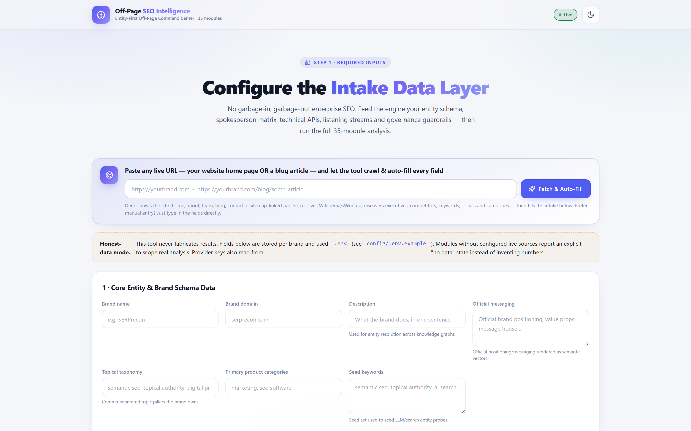
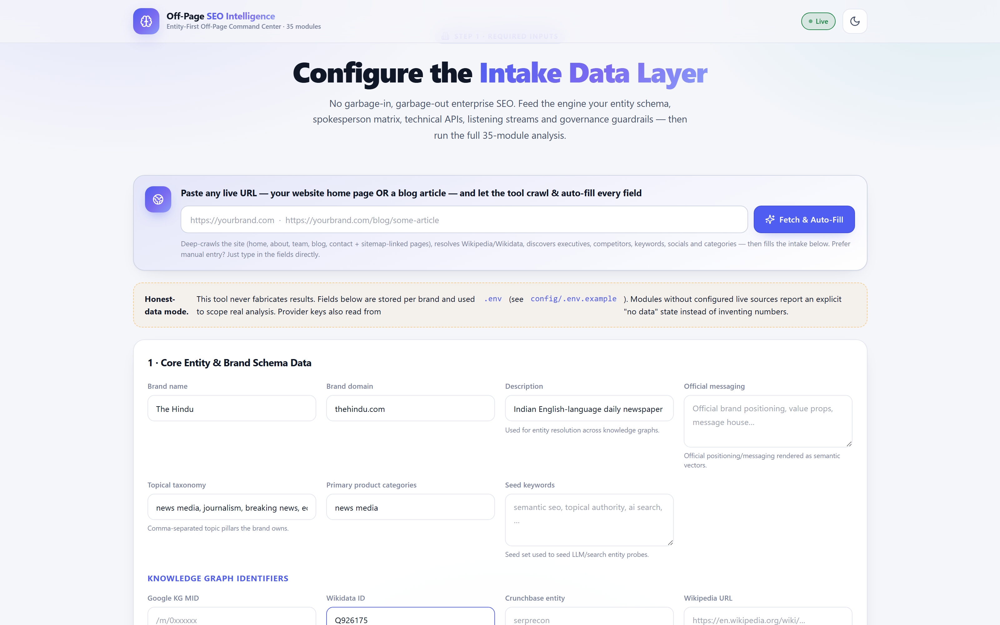
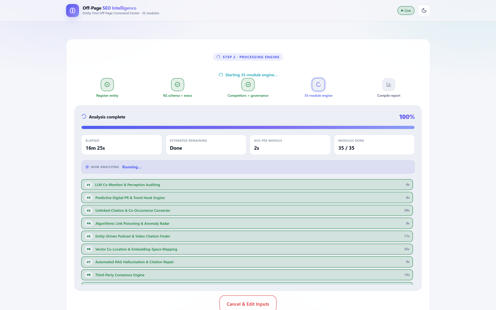
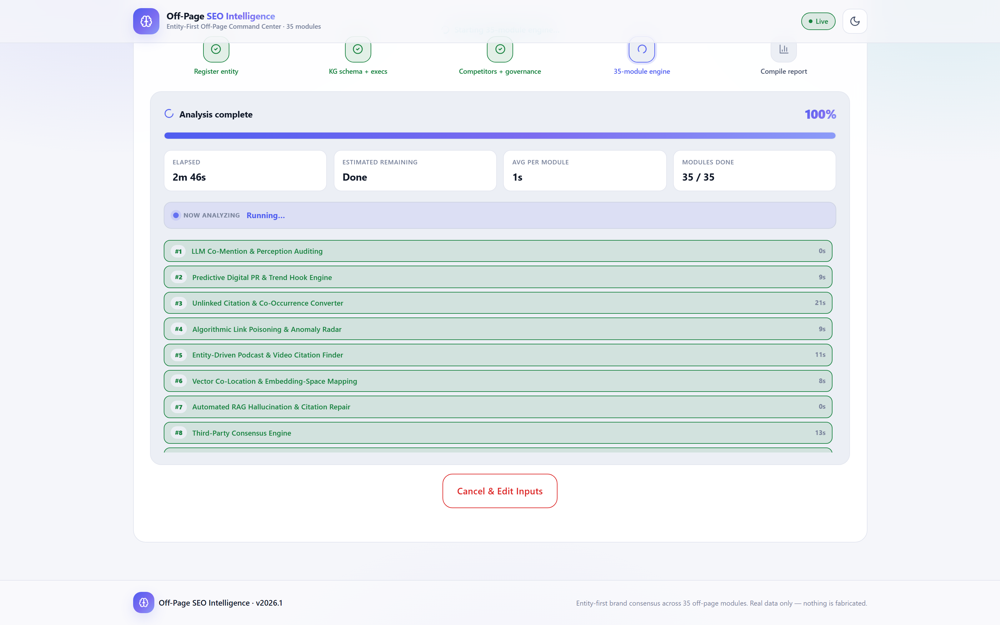
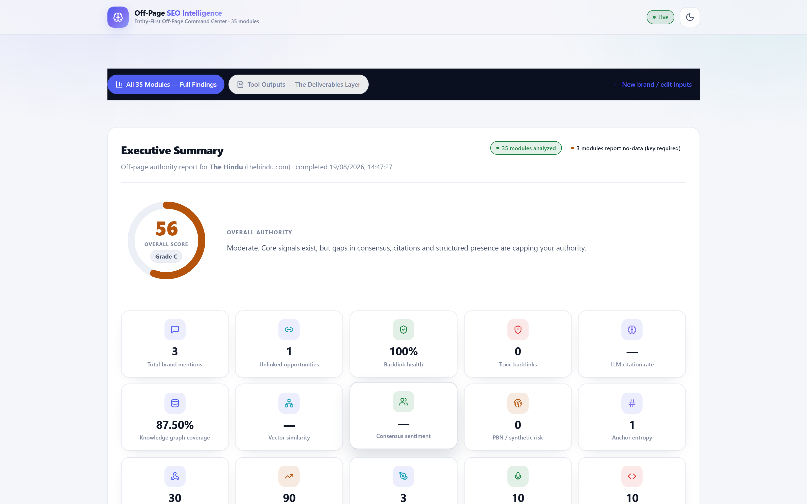
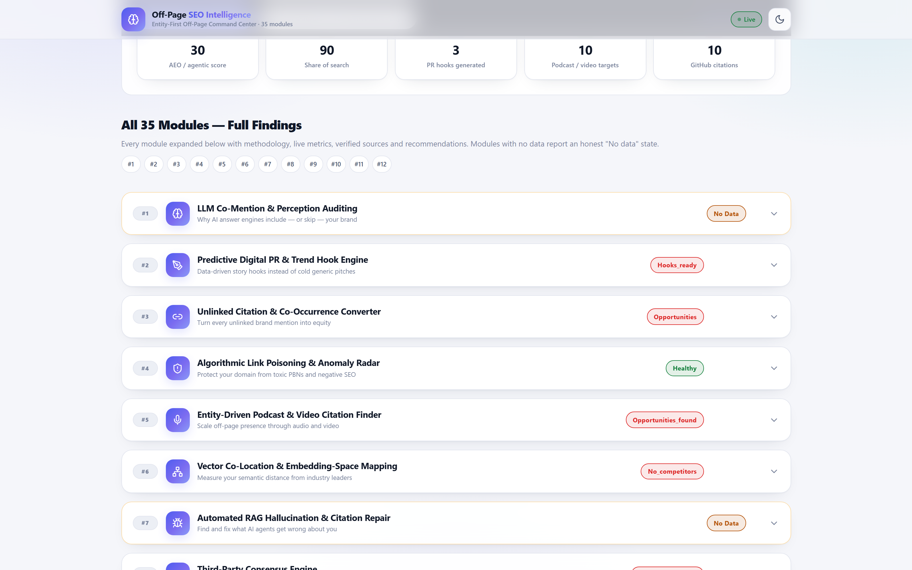
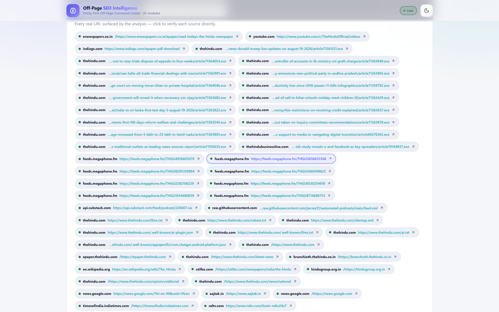
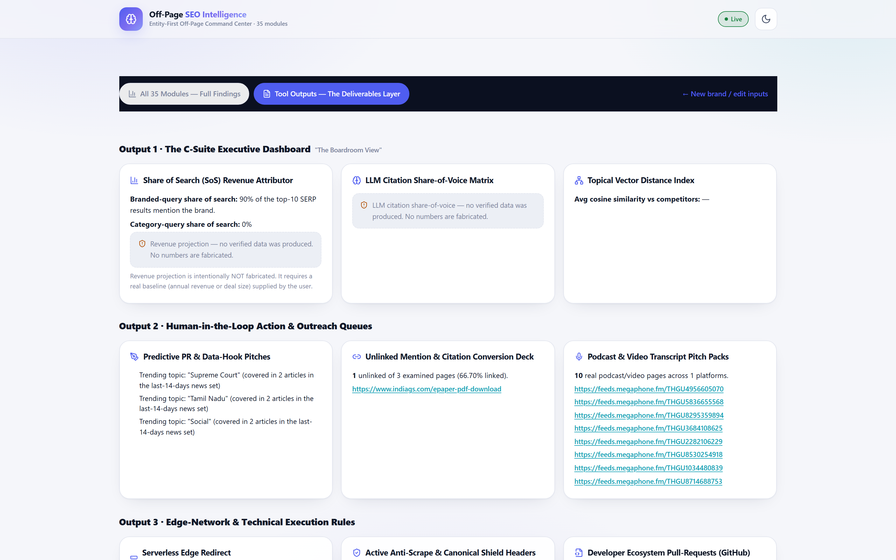
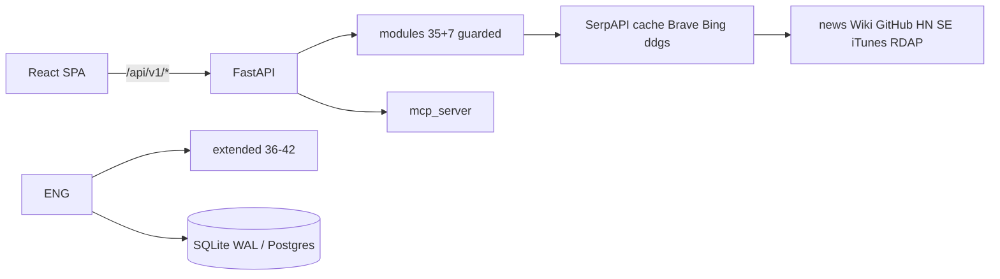

# Off-Page SEO Intelligence

**Live: https://complete-off-page-seo.onrender.com/ · API docs: https://complete-off-page-seo.onrender.com/docs · Health: https://complete-off-page-seo.onrender.com/health**

**Entity-First Off-Page Command Center · 35 Modules + 7 Extended + 10 P0 2026 Routers (50 Total) · 42 Sections · Real Data Only · v2026.4.0 Enterprise+ · 23 Tests Green**

A full-stack, 42-section off-page SEO engine that measures how search engines, LLMs and AI answers perceive, cite and trust your brand entity — **every number is collected live from real public sources. Nothing is fabricated.**

> **v2026.4.0 Enterprise+ Hotfix (24 Sep 2026)** — search-chain attribution (`SerpAPI → 7d-cache → Brave → Bing Web → Bing RSS → ddgs`), `llms.txt` scoped to ChatGPT/Perplexity/Claude, `run-async` default, `transcript_pipeline` transcript-first, `aio-tracker` v2, `prompt_tracking` v2, `cwv` CrUX field data, billing/vault guards, `link-intersect` + `disavow.txt`, `reviews-local`, `scheduled-reports`. Live proof: The Hindu — 42 sections, 39 ok / 3 honest-unavailable / 0 errors, Entity Authority 68.3 (B).
> **v2026.4.1 Deep Autofill (Sep 2026)** — URL autofill now deep-crawls sitemap (22 URLs) + author profiles, TF-IDF keyword mining, deep official-messaging aggregation, spokesperson Wikidata/KG enrichment, competitor Wikidata QIDs, `sc-domain:` auto-suggest. Intake fills 90%+ fields with verified sources.

- **Frontend:** React + Vite (TypeScript) — intake → live progress → report
- **Backend:** Python / FastAPI + SQLAlchemy + SQLite (WAL, non-blocking jobs)
- **Data layer:** SerpAPI (keyed) → 7d cache → Brave → Bing Web → Bing RSS → `ddgs` + news/Wikipedia/Wikidata/GitHub/HN/Stack Exchange/iTunes/RDAP — all free, no key required
- **Exports:** CSV/JSON + enterprise PDF (cover + KPIs + charts + Appendix A 42 sections)

---

## Table of Contents

1. [Live Demonstration](#live-demonstration)
2. [The Problem](#the-problem)
3. [What's Inside — 35 Modules](#whats-inside--the-35-modules)
4. [Real World Audit — The Hindu](#real-world-audit--the-hindu)
5. [Screenshots](#screenshots)
6. [Architecture](#architecture)
7. [Quick Start](#quick-start)
8. [Configuration](#configuration--api-keys)
9. [API Reference](#api-reference)
10. [Data Integrity](#data-integrity--anti-fabrication-guarantee)
11. [Project Structure](#project-structure)
12. [Roadmap](#contributing--roadmap)
13. [License](#license)

---

## Live Demonstration

Real screenshots from a live 42-section audit of **The Hindu** (`thehindu.com`, Wikidata `Q926175`).

| Step | Screenshot |
| --- | --- |
| 1 · Register entity + intake |  |
| 2 · Intake filled (autofill) |  |
| 3 · Live 35-module pipeline |  |
| 3b · Progress with timings |  |
| 4 · Executive summary |  |
| 5 · Key metrics |  |
| 6 · Verified sources |  |
| 7 · Deliverables |  |

> **Autofill demo:** paste `https://news.abplive.com` → deep crawl (25 pages, sitemap + author profiles) → pre-fills brand name `ABP Live English`, description, official messaging, `34` seed keywords, `11` topical pillars, `12` spokespeople with Wikidata QIDs, `2` competitors with QIDs, `sc-domain:news.abplive.com`.

---

## The Problem

Traditional off-page SEO measures one signal at a time with demo data. Modern authority is decided by **entities**: Google Knowledge Graph, LLM citations (ChatGPT/Claude/Perplexity/Gemini), RAG, podcasts/video transcripts, GitHub/forums, newsrooms and AEO surfaces (`llms.txt` — Claude/ChatGPT/Perplexity only; Google ignores it per June 15 2026).

This tool audits **all 42 surfaces at once** with one rule: **only real, verifiable, live-collected signals are reported.**

---

## What's Inside — The 35 Modules

Each module returns `ok` or `unavailable` (honest "no data"), plus assessment, metrics, verified sources, recommendations and methodology.

<details>
<summary><strong>Show 35 core modules</strong></summary>

| # | Module | What it measures |
| --- | --- | --- |
| 1 | LLM Co-Mention & Perception | LLM mention accuracy + cited URL verification |
| 2 | Predictive Digital PR | 14-day news scan → PR hooks with outlet/priority/draft |
| 3 | Unlinked Citation Converter | Pages mentioning you without linking |
| 4 | Link Poisoning Radar | Anomalous backlink patterns |
| 5 | Podcast & Video Finder | RSS feeds & YouTube citing your brand |
| 6 | Vector Co-Location | TF-IDF/cosine brand co-location |
| 7 | RAG Hallucination Repair | Verifies RAG citations |
| 8 | Third-Party Consensus | Sentiment & co-mentions |
| 9 | Agentic Commerce (GEO/AEO) | `llms.txt` / robots AI directives / schema |
| 10 | Synthetic Network De-Anonymizer | PBN signals + RDAP |
| 11 | Share-of-Search Simulator | Real SERP share + Monte Carlo scenarios |
| 12 | Edge-Redirect Salvage | Outbound link/redirect health |
| 13 | Negative SEO Counter-Measure | Risk terms (scam/fraud/lawsuit) |
| 14 | GitHub Citation Harvester | GitHub / Stack Overflow / HN refs |
| 15 | Transcription Monitor | Podcast/transcript mentions |
| 16 | Knowledge Graph Arbitrage | Wikidata coverage + competitor monitor |
| 17 | Telemetry Data-PR | (needs integration) honest unavailable |
| 18 | Multi-Agent Simulation | Baseline + labeled projections |
| 19 | Satellite Entity Radar | Sub-properties to claim |
| 20 | RAG-Cache Poisoning Defense | Stale/wrong AI citations |
| 21 | Visual Graph Alignment | Structured data + OG images |
| 22 | APN Proxy | `/api` / `/graphql` / `/openapi.json` probes |
| 23 | Co-Citation Graph Decay | Temporal decay |
| 24 | C2PA Proof Signing | SRI/C2PA signals |
| 25 | Legal/SEC Risk | Compliance pages + mentions |
| 26 | Geo-IP Localization | Region citations + hreflang |
| 27 | Zero-Party Data | `/data` / `/research` endpoints |
| 28 | Passage BERT Evaluator | Content metrics on top pages |
| 29 | Reddit & Forum Consensus | Reddit/HN/Quora (entity-gated) |
| 30 | Competitor BERT Vectors | Phrase extraction vs competitors |
| 31 | Agentic API Auditor | Agent protocol scan |
| 32 | Anchor Entropy Predictor | Shannon entropy (4 classes) + SpamBrain gauge |
| 33 | AI Crawler Pinger | robots/sitemap/IndexNow/AI-bot probe |
| 34 | FTC Penalty Shield | Sponsored mentions + disclosure checks |
| 35 | Hreflang Equity Balancer | Hreflang + cannibalization risk |

</details>

<details>
<summary><strong>Show extended modules 36–42</strong></summary>

| # | Module | What it measures |
| --- | --- | --- |
| 36 | AI Bot Crawler Governance | `llms.txt`/robots/ai.txt/ai-plugin + governance score |
| 37 | Daily Prompt Tracking | Fixed prompts, citation rate, SoV, sentiment |
| 38 | Knowledge Graph Ops | sameAs → Wikidata → Wikipedia → KG chain |
| 39 | UGC Depth | Reddit/LinkedIn/YouTube/G2/Trustpilot aggregation |
| 40 | Image + Video Backlinks | Logo usage without attribution |
| 41 | E-E-A-T Author Graph | SME authority score (publications/credentials/KG/depth) |
| 42 | Proxy Share-of-Voice | 10-prompt SERP proxy SoV (`proxy_sov_free`) |

</details>

---

## Real World Audit — The Hindu

**19 Aug 2026** — 35 modules in ~72s, authority **55.9/100**, 3 honest "no data" (LLM keys missing), 15 verified URLs (ePaper dirs, YouTube, sitemaps, 6 podcast feeds, Hacker News threads, Wikipedia).

**14 Sep 2026 (v2026.3)** — 42 sections, **39 ok / 3 honest-unavailable / 0 errors, Entity Authority 68.3 (B)** after monolith split; snapshots + diff preserved.

Verified URLs per module (excerpt): `thehindu.com/llms.txt`, `thehindu.com/sitemap.xml`, `enewspapers.co.in`, `youtube.com/c/TheHinduOfficial`, `Q926175` (87.5% triple coverage, 44 sitelinks).

---

## Screenshots

Full gallery in [Live Demonstration](#live-demonstration). Each module card shows methodology, live metrics, verified sources and next steps.

---

## Architecture



**Safety layers:** `WRONG_ENTITY_LEXICON` + `_entity_ok()` gate every citation; own-domain/subdomain treated as brand; honesty layer (`_module_unavailable` when keys missing; projections labeled; no synthetic fallbacks).

---

## Quick Start

```bash
pip install -r requirements.txt        # ddgs, reportlab, apscheduler included
cd frontend && npm install && npm run build && cd ..
python scripts/init_db.py
python main.py                          # http://localhost:8000 (reload)
# or: python -m uvicorn main:app --host 127.0.0.1 --port 8000
# Open: http://127.0.0.1:8000  Docs: /docs  Health: /health
```

**Deploy (Docker on Render):** Blueprint uses `Dockerfile` + `render.yaml` (`/health`, 1 GB disk at `/app/data`). Set `SECRET_KEY`, `FRONTEND_ORIGINS`, `REQUIRE_AUTH=false`. Live: https://complete-off-page-seo.onrender.com/

---

## Configuration & API Keys

Copy `config/.env.example` → `.env` (gitignored). Missing keys → honest `unavailable`, never fabricated.

| Provider | Env var(s) | Fallback |
| --- | --- | --- |
| SerpAPI | `SERPAPI_KEY` | Bing RSS → `ddgs` |
| NewsAPI | `NEWSAPI_KEY` | Bing/Google News RSS |
| Ahrefs / Moz / Majestic | `AHREFS_API_KEY` / `MOZ_*` / `MAJESTIC_API_KEY` | RDAP only / — |
| LLMs | `OPENAI_API_KEY` / `ANTHROPIC_API_KEY` / `PERPLEXITY_API_KEY` | `unavailable` |
| Google KG | `GOOGLE_API_KEY` | Wikipedia/Wikidata |
| GSC/GA4 | `GSC_CREDENTIALS_FILE` / `GA4_PROPERTY_ID` | `unavailable` |

**Intake depth** (`ToolApp → IntakeForm`, per-brand, no migration):

| Area | Fields |
| --- | --- |
| Entity schema | KG MID, Wikidata ID, Crunchbase, Wikipedia, messaging, taxonomy, categories, seed keywords |
| Spokesperson matrix | Bio, credentials, expertise, quotes, socials + KG MID / Wikidata ID / department / SME flag |
| Technical APIs | GSC file + `sc-domain:` property, GA4 ID, bot-crawl API, link-graph providers |
| Listening streams | 14 sources + 6 transcript-first streams + 3 AI engines |
| Governance | Risk slider 0–100, tactics, blocked domains/topics, max outreach/day, FTC/SEC rules |

Autofill: paste any live URL (home or article) → `POST /api/v1/scraper/scrape-website` deep-crawls home + sitemap + about/team/author pages, resolves Wikidata/Wikipedia, discovers spokespeople (bylines + infobox + prose) + TF-IDF keywords + competitors, then fills the form. Every field stays editable.

```bash
python scripts/verify_engine.py
```

---

## API Reference

Docs at `/docs` (or live). Health at `/health`.

| Area | Prefix |
| --- | --- |
| Brands / Intake | `/api/v1/brands` / `/api/v1/intake` |
| Analysis | `/api/v1/analysis` (`run-async` preferred; `run` deprecated Sunset 2026-12-31) |
| Scraper | `/api/v1/scraper` |
| Knowledge Graph / RAG / PR / Podcast / … | `/api/v1/*` (25+ routers) |
| P0 2026 | `/api/v1/aio-tracker` `/zero-click` `/transcripts` `/llms-audit` `/sentiment` `/source-influence` `/cwv` `/billing` `/link-intersect` `/reviews-local` `/scheduled-reports` `/geo-lift` |
| Provider status | `/api/v1/provider-status` |

Key endpoints: `POST /analysis/run-async {brand_id} → {job_id}`, `GET /analysis/progress/{id}`, `GET /analysis/results/{id}`, `GET /analysis/export/{id}?format=pdf|csv|json`.

---

## Data Integrity & Anti-Fabrication Guarantee

1. Every metric is live-collected (Bing/`ddgs`, news RSS, Wikipedia/Wikidata, GitHub/HN/SE, iTunes, RDAP).
2. No random/demo/synthetic values (verified by `anti_fabrication_check.py`).
3. Missing keys → `unavailable` with reason.
4. Wrong-entity results rejected via `WRONG_ENTITY_LEXICON`.
5. Correct domain attribution (e.g. `bbc.com`, not `hackernews.com`).
6. Every URL is real and clickable.
7. Projections labeled (revenue/simulation).
8. Nav-junk scrubbing (rejects `Contact us`, `ABOUT US`, `Trending…`, all-caps nav).
9. No static DA/competitor tables (deleted v2026.2).
10. UTF-8 safe file layer (never 500s).

---

## Project Structure

```
Complete-OFF-Page-SEO/
├── main.py / mcp_server.py / Dockerfile / render.yaml
├── config/settings.py  .env.example
├── backend/
│   ├── modules/  common llm pr kg technical risk registry base extended
│   ├── api/      analysis intake website_scraper + 25 routers + P0 routers
│   └── services/ search brand_config governance entity_authority verification ...
├── frontend/src/pages/ToolApp.tsx IntakeForm.tsx Deliverables.tsx
├── data/brand_configs.json analysis_results/ run_snapshots/  (gitignored)
├── scripts/  init_db verify_engine anti_fabrication_check lean_import_check
└── tests/ .github/workflows/ci.yml
```

---

## Contributing & Roadmap

**Shipped v2026.4 Enterprise+ (14 Sep 2026):** TLS verify, circuit breakers, LLM proxy v2, E-E-A-T audit, 14-bot governance, UGC citation-share, Transcript v2 (Whisper large-v3-turbo), CrUX INP/CLS/LCP, `link-intersect` + `disavow.txt`, `reviews-local`, `scheduled-reports`, 23 tests green.

**v2026.4.1 (Sep 2026):** Deep autofill (sitemap 22 + author profiles, TF-IDF, Wikidata/KG enrichment, `sc-domain:` suggest), frontend role-only name filter, taxonomy 10 pillars.

**Next:** LLM cross-engine hallucination matrix, Ahrefs/Moz PBN scoring, Postgres+Celery scale-out, auto-transcribe queue.

Contributions: fork → branch → PR (real-data-only rule enforced in CI).

---

## License

Apache-2.0. See `LICENSE`. Real-data-only rule survives licensing.

